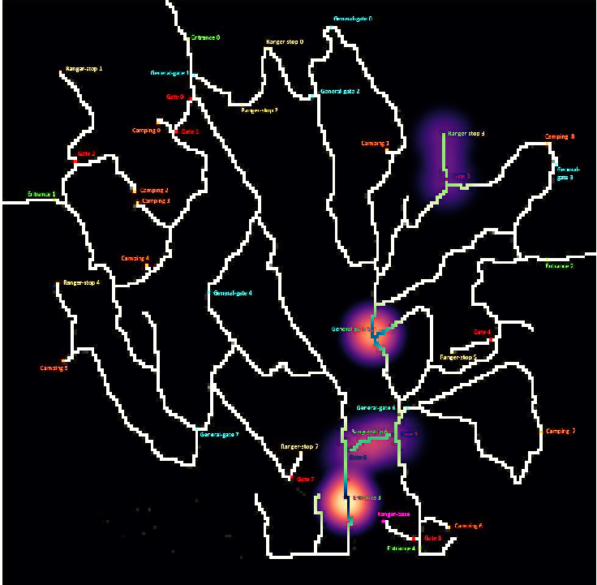
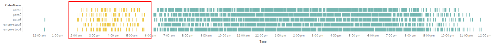

# 🌿 Unraveling Anomalous Traffic Dynamics in Boonsong Lekagul Nature Preserve 🌿
## VAST 2017: Mini-Challenge 1 🚗🔍

### Authors 🖋️
- **John Melwin Richard**  
- **Mahanand Adimulam**  
- **Niranjan Ambekar**  

---

## Abstract 📄
This study presents a comprehensive analysis of the interaction between vehicle traffic patterns and wildlife health within the Boonsong Lekagul Nature Preserve, specifically focusing on the impact on the Rose-Crested Blue Pipit bird species. The purpose is to unravel the effects of human vehicular activity on the preserve's delicate ecological balance.

---

### Keywords 🔑
Data Analysis, Visualization, Sense making

---

## 1. Introduction 📖
The Boonsong Lekagul Nature Preserve, visited by local
residents and tourists faces an important challenge. There
are signs indicating a decrease in the number of nesting
pairs of the Rose-Crested Blue Pipit, a bird cherished for its
attractive feathers and melodious songs. There could be some
odd vehicle behaviours that seem inconsistent with typical
park visitation patterns which might affect the birds. This
study aims to analyze these vehicle behaviors over time,
shedding light on whether and how they might be disrupting
the preserve’s delicate ecosystem.

---

## 2. Research Questions ❓

1. What are the predominant traffic flow patterns within the Boonsong Lekagul Nature Preserve?
2. What constitutes unusual vehicle behaviors within the Preserve?
3. How does vehicle data correlate with bird population changes, indicating human impact on avian habitats?

---

## 3. Dataset 🗂️
To address this challenge, two key data sources are utilized: Firstly, an extensive csv file with sensor-recorded vehicle movements in the Boonsong Lekagul Nature Preserve...

---

## 4. Visualization Approach 📊
### 4.1 Visualizing by Vehicle Type 🚛

_Figure 1: Vehicle Type-4 Anomaly_

### 4.2 Visualizing by Path 🛣️
  
_Figure 2: Vehicle Type-4 Anomaly_

### 4.3 Visualizing by Time ⏰

_Figure 3: Visualize by Time_

---

## 5. Conclusion 🎓
After analysis, it was understood that the preserve has regulations, and there is a pattern in vehicle behavior that adheres to these regulations...

---

## References 📚
1. S. Zhang, D. Guo, Y. Zhu, and D. Wang, "VAST Challenge 2017: Mini-challenge 1,"...
2. M. A. Whiting et al., "VAST Challenge 2017: Mystery at the Wildlife Preserve,"...
